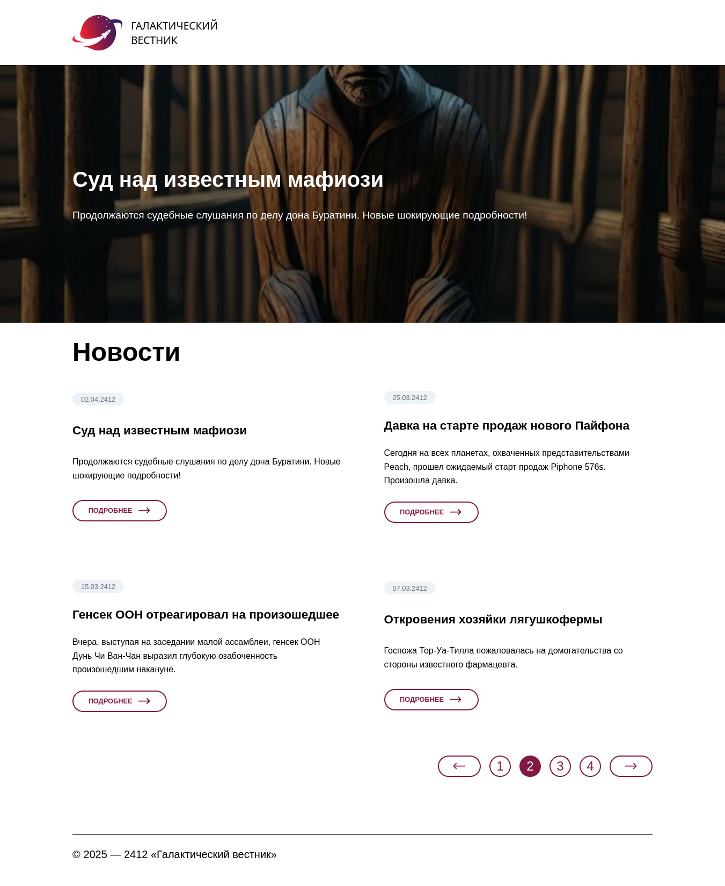

# Демонстрационный веб-сайт

## Содержание

1. [Описание](#1-Веб-сервер)
2. [Переменные среды](#2-Переменные-среды)
3. [Эндпоинты](#3-Эндпоинты)

## 1. Описание

Веб - сайт на php и MySQL выполненный с использованием ООП и MVC.

## 2. Переменные среды

Для запуска в production понадобятся следующие переменные среды:

|    Переменная среды | Пример значения по умолчанию | Краткое описание            |
|--------------------:|:-----------------------------|-----------------------------|
| MYSQL_ROOT_PASSWORD | password                     | пароль root пользователя бд |
|      MYSQL_DATABASE | mydb                         | название базы данных        |
|          MYSQL_USER | user                         | пользователь бд             |
|      MYSQL_PASSWORD | password                     | пароль пользователя         |
|          MYSQL_PORT | 3306                         | порт базы данных            |
|          MYSQL_HOST | db                           | хост (имя контейнера с бд)  |

Их нужно хранить в .env файле в корне проекта. Для запуска прописываем

`docker compose up --build`  

### 3. Эндпоинты

- `GET http://localhost:8080` - Главная страница;
- `GET http://localhost:8080/news/{id}` - Страница поста;  

